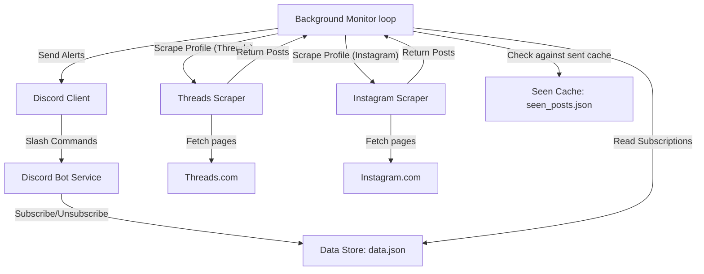

# Design Document: Tatsujin's Notify Discord Bot

This document outlines the complete system design for the **Tatsujin's Notify Discord Bot**, incorporating the proven architecture of the `seventeen_notify_discord_bot` interface.

---

## 1. Objectives

- **Threads & Instagram Profile Scraping:** Intercept and parse the dynamic React/GraphQL page data of public Threads profiles (e.g. `https://www.threads.com/@username`) and public Instagram profiles (e.g. `https://www.instagram.com/username/`) using Playwright headless browser automation.
- **Discord Bot Interface:** Run a Discord slash-commands bot (using `discord.py`) that lets servers manage their subscriptions natively across both platforms with seamless URL auto-detection.
- **Background Monitor:** Run a background loop that checks subscribed profiles on both platforms, filters new posts, enriches media galleries, and pushes notifications to designated channels.
- **Subscription Persistence:** Store subscriptions and already-sent posts locally in a robust JSON format with platform isolation.

---

## 2. System Architecture



---

## 3. Data Models & Persistence

We maintain three simple JSON-based storage files:

### A. Subscriptions Data (`data.json`)
Tracks active subscriptions across Discord channels with platform tagging:
```json
[
  {
    "username": "c910335",
    "channel_id": 123456789012345678,
    "server_id": 987654321098765432,
    "message": "Hey {mention}! {name} posted a new update!",
    "mention": "<@&1122334455667788>",
    "include_media": false,
    "platform": "threads"
  },
  {
    "username": "snackssion.ig",
    "channel_id": 123456789012345678,
    "server_id": 987654321098765432,
    "message": "Snackssion Instagram: {url}",
    "mention": "",
    "include_media": true,
    "platform": "instagram"
  }
]
```

### B. Seen Posts Cache (`seen_posts.json`)
Prevents sending duplicate alerts. All entries use a standardized platform-prefixed key format (`platform:username`) for clear namespace isolation:
```json
{
  "threads:c910335": [
    "3934428023188745554_63095361163",
    "3934428012669413235_63095361163"
  ],
  "instagram:snackssion.ig": [
    "3440761351310181880_12345"
  ]
}
```

### C. Display Names Cache (`display_names.json`)
Caches user full names across platforms:
```json
{
  "threads:c910335": "達人",
  "instagram:snackssion.ig": "零食鑑賞家 Snackssion"
}
```

---

## 4. Discord Bot Commands

- `/subscribe`: Subscribe to a user profile for the current channel.
  - `username` (String): The username or profile URL (e.g. `https://www.threads.net/@c910335` or `https://www.instagram.com/snackssion.ig/`).
  - `message` (String): The template message to send (supports `{name}`, `{text}`, `{preview_text}`, `{quoted_text}`, `{quoted_preview_text}`, `{url}`, `{mention}`).
  - `mention` (Mentionable, Optional): The user or role to ping.
  - `overwrite` (Boolean, Optional): Overwrite existing subscription for this channel (defaults to `False`).
  - `include_media` (Boolean, Optional): Include images/videos in notifications (defaults to `False`).
  - `platform` (Choice, Optional): `threads` or `instagram` (defaults to `threads`, auto-detected if a URL is provided).
- `/unsubscribe`: Remove a subscription.
  - `username` (String): The username or URL to unsubscribe from.
  - `platform` (Choice, Optional): Optional platform filter (`threads` or `instagram`).
- `/list`: Display all active subscriptions in the current channel (ephemeral, tagged with platform badges such as `[Threads]` and `[Instagram]`).
- `/test`: Trigger a manual fetch check and send a test notification.
  - `username` (String): The profile to test.
  - `silent` (Boolean): If true, makes the response ephemeral.
  - `platform` (Choice, Optional): Optional platform filter (`threads` or `instagram`).
- `/post`: Send a one-time test notification for a specific post.
  - `post_id` (String): The post ID/code or URL (e.g. `DH_eOgcSUww` or `https://www.instagram.com/p/C_ACjgVvIX4/`).
  - `message` (String): The message template to send.
  - `mention` (Mentionable, Optional): The user or role to notify.
  - `include_media` (Boolean, Optional): Include media in notifications (defaults to `False`).
  - `silent` (Boolean, Optional): Send ephemerally (defaults to `False`).
  - `platform` (Choice, Optional): Optional platform filter (`threads` or `instagram`).

---

## 5. Background Monitor Workflow

The monitor runs as a background task (`discord.ext.tasks` loop):
1. Retrieve all unique `(platform, username)` targets from `data.json` via `get_unique_targets()`.
2. For each target, invoke the scraper:
   - For Threads: load `https://www.threads.com/@username` and extract `thread_items`.
   - For Instagram: load `https://www.instagram.com/username/` with `wait_until="domcontentloaded"` and extract `polaris_ordered_timeline_connection`.
3. Filter posts to select only new ones not recorded in `seen_posts.json`.
4. If a new post is found:
   - For Instagram posts where any subscription has `include_media=True`, fetch full carousel media via `scrape_post_by_id`.
   - Format the notification message with the post URL, author display name, and text preview.
   - Send the message to subscribed Discord channels (with Discord `MediaGallery` components if media is present).
   - Mark the post ID seen in `seen_posts.json`.
5. Apply polite delays (`config.CHECK_DELAY_SECONDS`) between targets to avoid rate limiting.

---

## 6. Shared Browser Lifecycle (Scraping Engine Optimization)

To reduce CPU/memory overhead and prevent spawning multiple heavy browser processes, the bot implements a shared browser architecture:

- **Single Browser Process**: A single Playwright Chromium browser is launched when the bot starts (`setup_hook()`) and terminated when the bot shuts down (`close()`).
- **Context Isolation**: For each scraping task, the scraper leases a clean, isolated `BrowserContext` from the shared browser instance. This prevents cookie/session bleed while avoiding browser launch latency.
- **Fast DOMContentLoaded Navigation**: Pages load with `wait_until="domcontentloaded"` and dismiss login overlays immediately, completing profile and post lookups in ~1-2 seconds.

---

## 7. Media Gallery Notification Rendering

When `include_media` is enabled (`True`) for a subscription:
- If the post contains image or video URLs, the bot attaches a native Discord `discord.ui.MediaGallery` view via `LayoutView` v2 components.
- The scraper extracts media URLs from:
  1. `carousel_media` (for carousel posts)
  2. `video_versions` and `image_versions2` (for single-item posts)
  3. `text_post_app_info -> linked_inline_media` (for attached shared reels or video attachments)
- If the post contains more than 10 media items, the bot appends a warning note to notify the user that only the first 10 items can be shown in the gallery.

---

## 8. Modular Scraper Package Architecture

The scraping subsystem is decoupled into a dedicated package `src/scraper/`:

- **`src/scraper/common.py`**:
  - Dict search traversal (`find_key_in_dict`).
  - HTML script extraction (`extract_json_scripts`).
  - Media candidate extraction (`extract_media`, `extract_single_media_url`).
  - Sequence ID calculation (`get_numerical_id`).
  - Safe Playwright execution (`safe_run`).
  - DOM interaction helpers (`wait_for_posts`, `dismiss_login_modal`).
  - Browser context & page lifecycle management (`open_page`).
- **`src/scraper/threads.py`**:
  - Threads JSON post parser (`_parse_post`).
  - Threads HTML post extractor (`extract_threads_posts_from_html`).
  - Retried page scraper (`_extract_posts_with_retry`, `_scrape_threads_page_and_extract_posts`).
  - Public Threads scrapers (`scrape_threads_user_posts`, `scrape_threads_post_by_id`).
- **`src/scraper/instagram.py`**:
  - Snowflake media PK timestamp decoder (`_decode_instagram_timestamp`).
  - Profile metadata extractor (`_extract_profile_info_from_scripts`).
  - Timeline connection node parser (`_parse_instagram_timeline_node`).
  - Candidate scoring & single post builder (`_find_instagram_post_candidates`, `_score_instagram_post`, `_build_instagram_single_post`).
  - Feed and single post HTML extractors (`extract_instagram_posts_from_html`, `extract_instagram_single_post_from_html`).
  - Public Instagram scrapers (`scrape_instagram_user_posts`, `scrape_instagram_post_by_id`).
- **`src/scraper/__init__.py`**:
  - Platform dispatchers (`scrape_user_posts`, `scrape_post_by_id`).
  - Public and internal re-exports for transparent backward compatibility with callers and tests.

---

## 9. Anti-Bot Hardening & Rate-Limit Resilience Architecture

To prevent unauthenticated scrapers from triggering Meta's edge security and rate-limiting firewalls (`is_from_rle` / 302 login redirects), the bot integrates a multi-layered evasion and resilience strategy:

1. **Stealth Browser Initialization & CDP Client Hints Masking**:
   - Launches Chromium with `--headless=new`, `--disable-blink-features=AutomationControlled`, and `--disable-features=IsolateOrigins,site-per-process`.
   - Uses Chrome DevTools Protocol (`Network.setUserAgentOverride`) with structured `userAgentMetadata` to completely override native C++ `sec-ch-ua` headers, eliminating any `"HeadlessChrome"` strings at the transport layer and populating high-entropy `navigator.userAgentData`.
   - Injects stealth init scripts aligning `window.chrome`, `navigator.plugins`, `navigator.languages`, and `navigator.platform` (`Win32`) with the modern desktop User-Agent (`Chrome/133` on Windows 10).

2. **Persistent Storage & Cookie State Reuse**:
   - Instead of discarding cookies after each check (which makes repeated requests look like hundreds of distinct ephemeral devices from a single IP), the bot persists and reuses device identity tokens (`datr`, `mid`, `ig_did`, `csrftoken`) via `browser_state.json`.
   - Subsequent checks present these established tokens, maintaining a single consistent visitor profile.

3. **Detection of Rate Limits & Exponential Backoff Cooldown**:
   - If Meta issues an unauthenticated rate limit or login redirect (`is_from_rle`, `/accounts/login/`, or `require_login`), the scraper raises `InstagramRateLimitError`.
   - The monitoring loop catches this error, reports an alert to the Discord admin channel, and activates an automatic exponential cooldown timer (`instagram_cooldown_until = now + effective_cooldown`).
   - The base cooldown begins at `INSTAGRAM_CHECK_INTERVAL_SECONDS` (default: 1200s / 20m) and doubles on consecutive rate limits (e.g. 20m → 40m → 1h 20m ...) up to a configurable ceiling `INSTAGRAM_MAX_COOLDOWN_SECONDS` (default: 43200s / 12h).
   - Once an Instagram profile is scraped successfully without encountering rate limits, the backoff cooldown immediately resets back to the base interval (`INSTAGRAM_CHECK_INTERVAL_SECONDS`).
   - During the cooldown, all Instagram profile checks are cleanly bypassed without making network requests, allowing Meta's temporary sliding window to expire naturally.
   - Threads checks continue running without interruption during Instagram cooldowns.

4. **Request Jitter**:
   - Random jitter (`CHECK_JITTER_SECONDS` between targets and `HEARTBEAT_JITTER_SECONDS` on loop intervals) breaks deterministic fixed-interval request signatures.

5. **Decoupled Platform Polling Intervals**:
   - While Threads can be checked rapidly (every 5 minutes via `HEARTBEAT_DELAY_SECONDS`), unauthenticated Instagram profiles are governed by Meta's rolling daily IP quota (~80–100 requests per 24 hours).
   - The bot decouples Instagram polling via `INSTAGRAM_CHECK_INTERVAL_SECONDS` (default: 1200s / 20 minutes), ensuring daily request volume remains safely under Meta's anonymous threshold while maintaining rapid updates for Threads.
